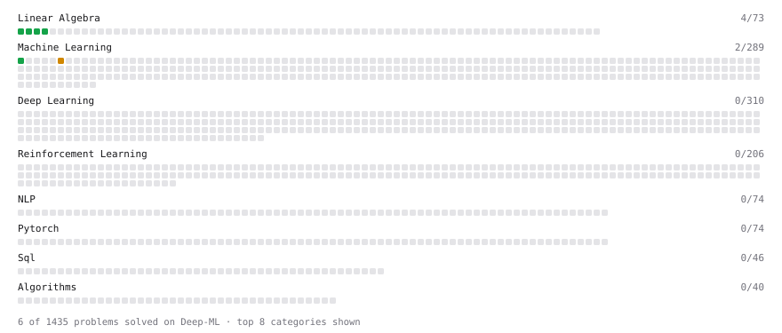

# Deep-ML

My machine learning practice from [Deep-ML](https://www.deep-ml.com). Every solution here was written by hand.

**13** solved · 13 problems · 0 labs · 0 math

[**Browse the interactive portfolio**](https://Lucialululu.github.io/deep-ml/) to replay this filling in over time.

## Problems

| | Difficulty | Solved | |
| --- | --- | --- | --- |
| [Calculate Covariance Matrix](https://www.deep-ml.com/problems/10) | easy | 2026-09-22 | [solution](problems/0010-calculate-covariance-matrix) |
| [Calculate Mean by Row or Column](https://www.deep-ml.com/problems/4) | easy | 2026-09-22 | [solution](problems/0004-calculate-mean-by-row-or-column) |
| [Convert Vector to Diagonal Matrix](https://www.deep-ml.com/problems/35) | easy | 2026-09-22 | [solution](problems/0035-convert-vector-to-diagonal-matrix) |
| [Implement Recall Metric in Binary Classification](https://www.deep-ml.com/problems/52) | easy | 2026-09-25 | [solution](problems/0052-implement-recall-metric-in-binary-classification) |
| [Linear Regression Using Normal Equation](https://www.deep-ml.com/problems/14) | easy | 2026-09-21 | [solution](problems/0014-linear-regression-using-normal-equation) |
| [Matrix-Vector Dot Product](https://www.deep-ml.com/problems/1) | easy | 2026-09-21 | [solution](problems/0001-matrix-vector-dot-product) |
| [Reshape Matrix](https://www.deep-ml.com/problems/3) | easy | 2026-09-21 | [solution](problems/0003-reshape-matrix) |
| [Scalar Multiplication of a Matrix](https://www.deep-ml.com/problems/5) | easy | 2026-09-24 | [solution](problems/0005-scalar-multiplication-of-a-matrix) |
| [Sigmoid Activation Function Understanding](https://www.deep-ml.com/problems/22) | easy | 2026-09-24 | [solution](problems/0022-sigmoid-activation-function-understanding) |
| [Transpose of a Matrix](https://www.deep-ml.com/problems/2) | easy | 2026-09-21 | [solution](problems/0002-transpose-of-a-matrix) |
| [Implement Long Short-Term Memory (LSTM) Network](https://www.deep-ml.com/problems/59) | medium | 2026-09-24 | [solution](problems/0059-implement-long-short-term-memory-lstm-network) |
| [Matrix times Matrix ](https://www.deep-ml.com/problems/9) | medium | 2026-09-24 | [solution](problems/0009-matrix-times-matrix) |
| [Principal Component Analysis (PCA) Implementation](https://www.deep-ml.com/problems/19) | medium | 2026-09-21 | [solution](problems/0019-principal-component-analysis-pca-implementation) |

---

_This file is regenerated by Deep-ML on every push._
